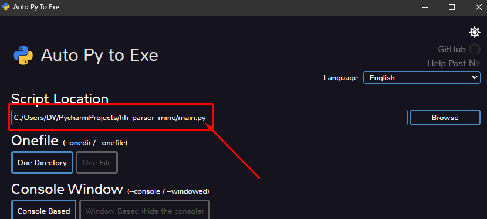

<!-- TOC -->
* [Vacancies parser from HH](#vacancies-parser-from-hh)
  * [Development launch](#development-launch)
  * [Usage](#usage)
  * [Troubleshooting](#troubleshooting)
  * [Convert into exe](#convert-into-exe)
<!-- TOC -->


# Vacancies parser from HH

This parser can:

- Execute some vacancies search on [Headhunter](https://hh.ru)
- Get all the pagination and find each vacancies
- Collect data from each vacancy
- Convert data into Excel
- Incredible!


Al this with web-interface for your users to work with!

 

And an additional instruction, how to convert this into an exe-file!!

  

## Development launch

Tested on Windows!

Load this shiny repository to wherever you like using pip:

1. Press Win + R, type cmd or powershell, and press Enter
2. Use the cd command to change the current directory to the location where you want to clone the repository

```bash
cd path\to\desired\directory
```

3. Use the git clone command to clone the repository. Replace <repository_url> with the actual URL of the GitHub repository

```bash
git clone https://github.com/aaskorohodov/hh_parser.git
```

Now it's time to install python!

1. Visit the official Python website: https://www.python.org/downloads/.
2. Click on the "Downloads" tab.
3. Choose the latest version for your system (tested with Python 3.10.xx).
4. Scroll down to the Files section and download the installer for Windows (usually a .exe file)
5. Double-click the downloaded installer.
6. Check the box that says "Add Python to PATH" during installation.
7. Click "Install Now" to start the installation.
8. Open Command Prompt or PowerShell.
9. Type the following command to check the installed Python version:

```bash
python --version
```

You should see the Python version number.

Now you will need a venv!

1. Open Command Prompt or PowerShell. If one encounters some problems - select another!
   1. To open CMD:
      1. Press WIN
      2. Type CMD
      3. Open this thing!
2. Type the following command to install virtualenv using pip:

```bash
pip install virtualenv
```

3. Open Command Prompt or PowerShell and navigate to downloaded repository (hh_parser, most-likely).

```bash
cd path\to\desired\directory
```

4. Create a virtual environment by running:

```bash
python -m venv venv
```

5. In the same Command Prompt or PowerShell window, activate the virtual environment:

```bash
.\venv\Scripts\activate
```

You should see the virtual environment's name in your command prompt.

6. Install all libraries required! In the same Command Prompt or PowerShell window:

```bash 
pip install -r requirements.txt
```

Make sure that you terminal is in the correct directory! You need root-folder with repository,
there should be a file named 'requirements.txt'!

Now, you can launch this in development-mode! In the same Command Prompt or PowerShell window:

```bash
python main.py
```

Make sure that you terminal is in the correct directory! You need root-folder with repository,
there should be a file named 'main.py', this is the one you are launching!

Now, you should see something like this:


Copy this address and open this thing with your browser! Now you should see this:


Now use it!

## Usage

Type vacancy you need, for example:


Wait a bit:


Great! Now you can load this into Excel:


Excel will appear in 'results' folder, which will be created in the downloaded repository.

## Troubleshooting

Most-likely you will face some form of outdated parser-code. This is due to the fact, that
websites are being updated from time to time. To troubleshoot this, you will need some skills
in Python and HTML!

1. Make sure url is correct! You can find it in Parser._base_url.
   1. Get to the actual page and check if this URL actually works (in your browser)
2. Check if some elements were changed on the page, for example:
   1. 'company = vacancy.find('div', {'class': 'vacancy-serp-item__meta-info-company'}).text'
   2. Is it still div?
   3. Is it still 'vacancy-serp-item__meta-info-company'?

That should be it!

## Convert into exe

To simplify usage, you may want to pack this script into exe. This way you will be able to ssend this script to a
User, with no need for this User to install any additional software like Python.

Install this:

```commandline
pip install auto-py-to-exe
```

Launch a beautiful GUI:

```commandline
auto-py-to-exe
```

* Select main.py (or other entrypoint, if you changed the name):


* Select 2 additional folders (static and templates):


* Push a big button to create your exe!


* If all goes well – you will face a folder named 'output'. Find main.exe there, to test it!
* Zip all this folder and send to who ever you want!

